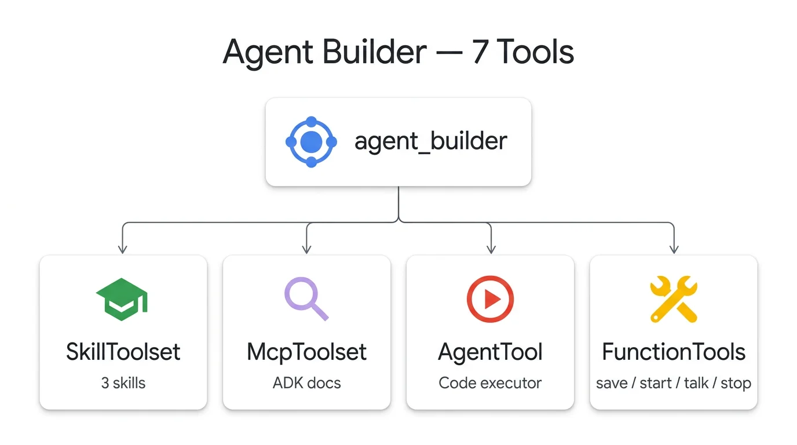
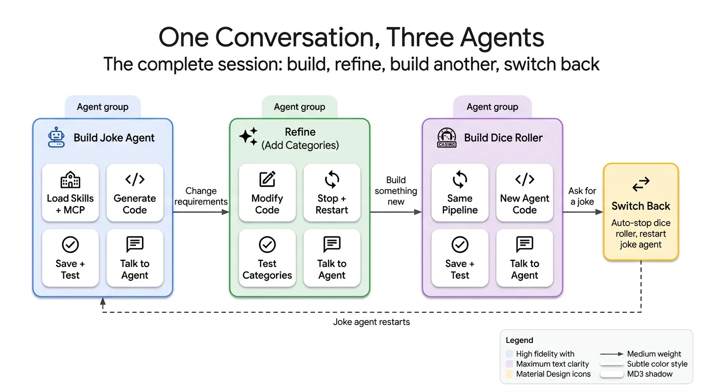
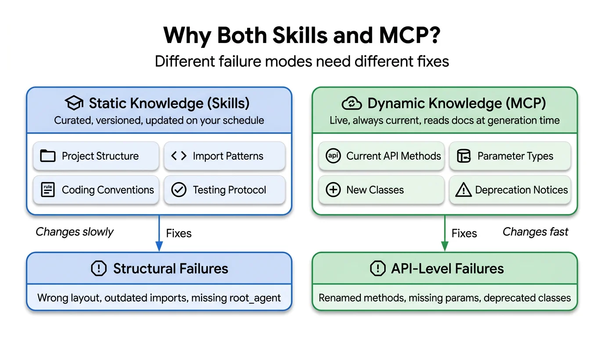

# Build an Agent That Builds ADK Agents

> Supporting code for [Build an Agent That Builds ADK Agents](https://lavinigam.com/posts/adk-iterative-refinement/)

A meta-agent that builds, tests, and refines other ADK agents through iterative loops. Describe the agent you want in plain English — the builder generates the code, validates it, starts it as a local server, and lets you talk to it. Change requirements mid-conversation and it rebuilds, retests, and hands it back.



## What You'll Learn

- Compose **SkillToolset**, **McpToolset**, and **Code Execution** into a single builder agent
- Write a custom testing skill that drives validation through code execution
- Build lifecycle FunctionTools for agents: save, start, talk, stop
- Apply the sculptor pattern with save-first testing
- Use the **static knowledge + dynamic knowledge** pattern (Skills for conventions, MCP for current APIs)

## Prerequisites

- Python 3.11+
- [Google ADK](https://google.github.io/adk-docs/) (`pip install google-adk`)
- A Google API key ([get one here](https://aistudio.google.com/apikey))

## Quick Start

```bash
# Clone the repo
git clone https://github.com/lavinigam-gcp/build-with-adk.git
cd build-with-adk/adk-iterative-refinement

# Set up environment
python3 -m venv .venv && source .venv/bin/activate
pip install -r app/requirements.txt

# Configure API key
cp app/.env.example app/.env
# Edit app/.env with your GOOGLE_API_KEY

# Run with ADK Web UI
adk web app
```

## Demo Journey

Once the agent is running, try this three-part journey:

### 1. Build a Joke Agent

> Build me a joke agent with one tool called tell_joke that returns a random programming joke from a hardcoded list of 5 jokes. Save and test it.

The builder loads its skills, fetches ADK docs via MCP, generates the code, saves it, validates imports and structure, starts the agent, and sends a test message — all in one turn.

Then talk to it:

> Tell me a joke

### 2. Refine Mid-Conversation

> Can you add more jokes and also add new categories like animals and puns? Let the agent decide which category to pick based on what I ask.

The builder stops the running agent, modifies the code, re-saves, restarts, and tests the new categories.

Then test the categories:

> Tell me an animal joke

> Tell me a pun

### 3. Build a Different Agent

> Now build me a dice roller agent with one tool called roll_dice that takes the number of sides as an integer and returns a random roll result.

Same pipeline, completely different agent. Then switch back:

> Tell me a coding joke

The builder auto-stops the dice roller and restarts the joke agent.

### More Queries to Try

| Query | What It Tests |
|-------|---------------|
| Build a unit converter with convert_temperature (celsius→fahrenheit) and convert_distance (miles→km) | Multi-tool agent |
| Build a greeting agent that says hello in english, spanish, french, japanese, hindi | Dictionary-based tool |
| Build a quote agent that returns a random motivational quote from a list of 5 | Simple single-tool agent |

## Architecture



The root agent composes seven tool entries across four groups:

- **SkillToolset** — ADK coding conventions and a custom testing protocol
- **McpToolset** — live ADK documentation via MCP
- **AgentTool** — wraps a code executor sub-agent (workaround for ADK's one-executor-per-agent constraint)
- **FunctionTools** — save_agent_code, start_agent, talk_to_agent, stop_agent



**Key design pattern:** Static knowledge (Skills) for slow-changing conventions + dynamic knowledge (MCP) for fast-changing API surfaces. This separation applies to any code-generation agent targeting a fast-moving SDK.

## Project Structure

```
adk-iterative-refinement/
├── app/
│   ├── agent.py          # Root agent with 7 tools across 4 groups
│   ├── tools.py          # Lifecycle FunctionTools (save, start, talk, stop)
│   ├── __init__.py
│   ├── requirements.txt
│   ├── .env.example
│   └── skills/
│       └── agent-tester/  # Custom testing skill (save-first protocol)
├── assets/               # Architecture diagrams
└── README.md
```

## Read the Full Blog

For a detailed walkthrough of the concepts, patterns, and implementation decisions behind this agent, read the full blog post:

**[Build an Agent That Builds ADK Agents](https://lavinigam.com/posts/adk-iterative-refinement/)**

## License

Apache 2.0
