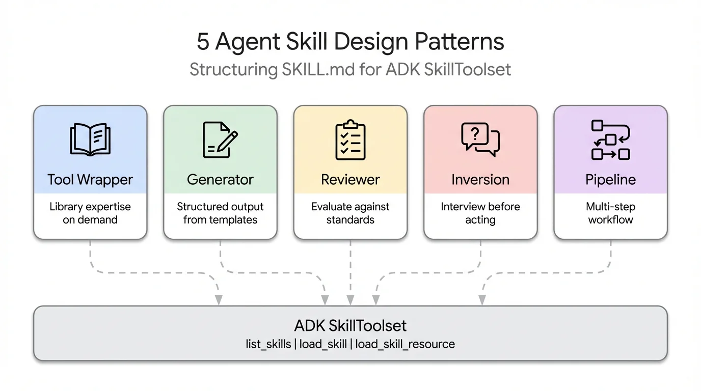

# 5 Agent Skill Design Patterns Every ADK Developer Should Know

> Supporting code for [5 Agent Skill Design Patterns Every ADK Developer Should Know](https://lavinigam.com/posts/adk-skill-design-patterns/)

Five recurring design patterns for structuring SKILL.md content in ADK's SkillToolset — Tool Wrapper, Generator, Reviewer, Inversion, and Pipeline — each with a working implementation you can run, modify, and extend.

## What You'll Learn

- Define **Tool Wrapper** skills that encode library best practices (FastAPI conventions)
- Build **Generator** skills that produce structured output from templates (technical reports)
- Create **Reviewer** skills that evaluate code against checklists (code review with severity levels)
- Design **Inversion** skills that interview the user before acting (project planning)
- Chain **Pipeline** skills that enforce multi-step workflows (API documentation generation)

## Prerequisites

- Python 3.11+
- [Google ADK](https://google.github.io/adk-docs/) (`pip install google-adk`)
- A Google API key ([get one here](https://aistudio.google.com/apikey))

## Quick Start

```bash
# Clone the repo
git clone https://github.com/lavinigam-gcp/build-with-adk.git
cd build-with-adk/adk-skill-design-patterns

# Set up environment
python3 -m venv .venv && source .venv/bin/activate
pip install -r app/requirements.txt

# Configure API key
cp app/.env.example app/.env
# Edit app/.env with your GOOGLE_API_KEY

# Run with ADK Web UI
adk web app

# Or run with API server
adk api_server app --port 8000
```

## Try It

Test these queries to see each pattern in action:

| Query | Pattern Triggered | What Happens |
|-------|------------------|-------------|
| "Review this Python code: `def ProcessData(input, data=[]): ...`" | Reviewer | Loads checklist, catches 3 bugs, produces scored report |
| "Write a technical report on our API migration" | Generator | Loads template + style guide, fills report sections |
| "Help me plan a new microservice" | Inversion | Asks 6 structured questions across 3 phases before planning |
| "How should I handle FastAPI dependency injection?" | Tool Wrapper | Loads FastAPI conventions, applies best practices |
| "Document this Python module" | Pipeline | 4-step workflow: Parse → Generate → Assemble → Quality Check |

## Architecture



One agent, five skills, one SkillToolset. Each skill demonstrates a different design pattern for structuring SKILL.md content. The agent uses progressive disclosure (L1 → L2 → L3) to load only the skill it needs, paying ~100 tokens per skill at startup instead of loading all instructions upfront.

## Project Structure

```
adk-skill-design-patterns/
├── app/
│   ├── agent.py              # Main agent with SkillToolset loading all 5 patterns
│   ├── __init__.py
│   ├── requirements.txt
│   └── skills/
│       ├── api-expert/        # Pattern 1: Tool Wrapper
│       ├── report-generator/  # Pattern 2: Generator
│       ├── code-reviewer/     # Pattern 3: Reviewer
│       ├── project-planner/   # Pattern 4: Inversion
│       └── doc-pipeline/      # Pattern 5: Pipeline
├── assets/                    # Diagrams and cover image
└── README.md
```

## Read the Full Blog

For a detailed walkthrough of the concepts, patterns, and implementation
decisions behind this agent, read the full blog post:

**[5 Agent Skill Design Patterns Every ADK Developer Should Know](https://lavinigam.com/posts/adk-skill-design-patterns/)**

## License

Apache 2.0
