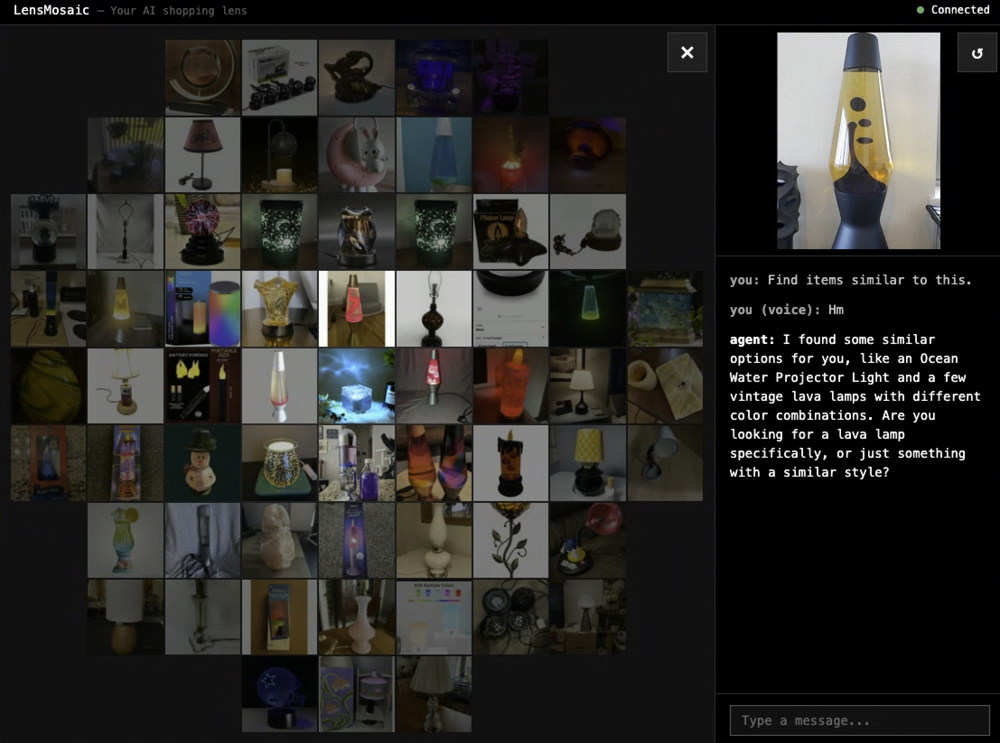
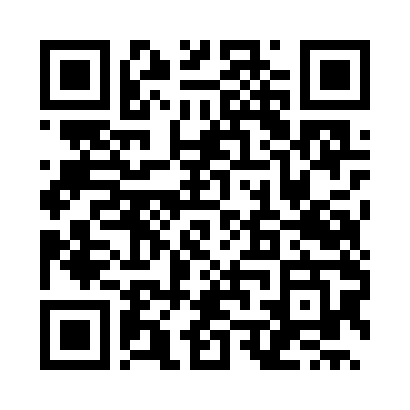
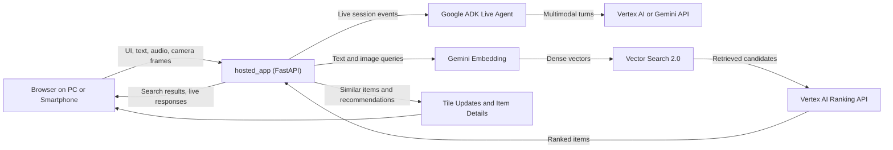

# LensMosaic

LensMosaic is a **live multimodal shopping demo** that combines **camera
input**, **voice interaction**, and **product retrieval** in a single web app.


[Demo Video](https://youtu.be/SgMn-6q8Qg8)

## Try It

Open the hosted app here:
[https://lens-mosaic-nhhfh7g7iq-uc.a.run.app](https://lens-mosaic-nhhfh7g7iq-uc.a.run.app)

Or scan this QR code on your phone:



### User Journeys

- **Use the camera as a real-time "shopping lens":** the user points the camera at any item, and the app instantly surfaces visually and semantically similar products from millions of catalog items, like a magnifying lens for a large shopping catalog.
- **Get recommendations from visual context and a spoken request:** the user asks the agent for something that matches what they are looking at or describes a need such as a gift or complementary product, and the agent researches likely matches, turns them into product-search queries, and shows the recommended products.

## What the App Provides

- **Live text, voice, and camera interaction** with an AI shopping assistant built with [**Google ADK**](https://google.github.io/adk-docs/) and the [**ADK Gemini Live API Toolkit**](https://google.github.io/adk-docs/streaming/).
- **Similar-item search and recommendations** powered by [**Gemini Embedding 2**](https://docs.cloud.google.com/vertex-ai/generative-ai/docs/embeddings/get-text-embeddings), [**Vector Search 2.0**](https://cloud.google.com/vertex-ai/docs/vector-search-2/overview), and [**Vertex AI Ranking API**](https://docs.cloud.google.com/generative-ai-app-builder/docs/ranking).
- **Local development and hosted deployment** using the same app architecture on [**Cloud Run**](https://cloud.google.com/run/docs).

## Architecture and Tech Stack

LensMosaic is built as a **single-origin web app** in `hosted_app`. The same
server is responsible for serving the browser UI, handling search and
item-detail API requests, and maintaining live WebSocket sessions.



### Application Server

- [**FastAPI**](https://fastapi.tiangolo.com/) is the main application framework.
- **Static assets** are served directly from the app server.
- **HTTP routes** cover health checks, search, ranking, and item details.
- **WebSocket routes** handle live multimodal sessions and tile updates.

### Browser Experience

- The client runs in a **browser on desktop or smartphone**.
- **Text, microphone audio, and camera frames** are sent to the hosted app over the same origin.
- **Smartphone testing** is especially useful because the camera workflow is part of the core product experience.

### Live Agent Layer

- **Google ADK** is used to run live agent sessions.
- The agent receives **text, audio, and image inputs** from the browser.
- **Live responses** can be backed by either [**Vertex AI**](https://cloud.google.com/vertex-ai/docs) or [**Gemini API**](https://ai.google.dev/gemini-api/docs), controlled by environment configuration.
- The agent can call app tools such as **`find_items(...)`** to turn conversation context into catalog retrieval.

### Search and Retrieval Pipeline

- [**Gemini Embedding 2**](https://cloud.google.com/vertex-ai/generative-ai/docs/embeddings/get-text-embeddings) is used to create query vectors for both text and image-driven retrieval.
- [**Vector Search 2.0**](https://cloud.google.com/vertex-ai/docs/vector-search-2/overview) is the main retrieval backend, and the app uses it as a **hybrid search system** by querying both text and image embedding fields, then fusing the ranked results locally with **Reciprocal Rank Fusion** so products can be matched by semantic relevance, visual similarity, or both.
- [**Vertex AI Ranking API**](https://docs.cloud.google.com/generative-ai-app-builder/docs/ranking) is used as the final reranking layer for merged search candidates.

### Similar-Item Search Architecture

- **Camera-driven similar search** runs through a process-wide background worker pool.
- The worker pool is configurable through **`LENS_MOSAIC_SIMILAR_SEARCH_WORKERS`**.
- **Session state** is stored in process and keyed by **`session_id`**.
- **Similar results** are published back to the browser through the tile WebSocket channel.
- The current design is optimized for a **single warm app instance** rather than distributed multi-instance session routing.

## Repository Layout

```text
lens-mosaic/
├── README.md
├── blog_sample/
│   ├── README.md
│   └── app/
└── hosted_app/
    ├── README.md
    ├── Dockerfile
    ├── pyproject.toml
    ├── app/
    └── test/
```

## Main Components

### `hosted_app`

The **production-oriented app** in this repo. It serves the UI and APIs from
the same origin and supports both **local HTTPS/LAN testing** and **Cloud Run
deployment**.

**Start here** if you want to work on the real product experience.

See:

- [hosted_app/README.md](hosted_app/README.md)
- [hosted_app/test/README.md](hosted_app/test/README.md)

### `blog_sample`

A **smaller local sample** that reuses the hosted UI and catalog APIs. It is
easier to read than `hosted_app`, but it does not implement the full stack
locally.

**Start here** if you want a compact reference for a tutorial, demo, or blog post.

See:

- [blog_sample/README.md](blog_sample/README.md)
